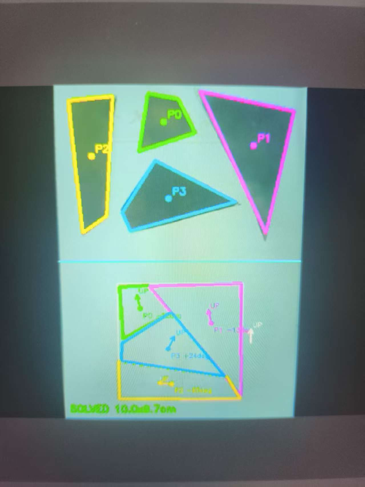
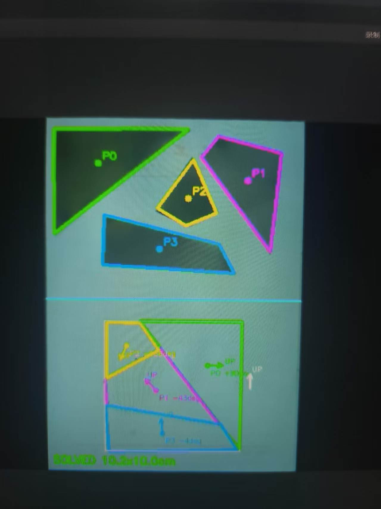

# K230 拼图装置上位机

本实现对应 2026 TI 杯 E 题“拼图装置”。K230 负责摄像头标定、碎片识别、拼图求解和动作规划；下位机只负责机械臂/吸盘的运动执行。

> **白色背景即 A4 纸**：碎片（钢板/铁片）放置在白色 A4 纸上，A4 纸既是工作背景，也是摄像头标定基准（自动四角标定）。正式赛题 A4 尺寸为 **21 × 29.7 cm**，代码中 `PAPER_WIDTH_CM` / `PAPER_HEIGHT_CM` 填的就是这张纸（白色背景）的物理尺寸。

## 当前纸张和钢板尺寸

物理尺寸参数集中在 `puzzle_k230.py` 最前面。当前临时测试使用 B5 白纸和
约 `10×10 cm` 的钢板：

```python
PAPER_WIDTH_CM = 19.0
PAPER_HEIGHT_CM = 26.5
EXPECTED_TARGET_WIDTH_CM = 10.0
EXPECTED_TARGET_HEIGHT_CM = 10.0
TARGET_SIZE_TOLERANCE_CM = 1.2
USE_EXPECTED_TARGET_SIZE = True
STRICT_CONTEST_TARGET_SIZE = False
```

换纸或换钢板时只改这一组。正式赛题恢复 A4 时填入 `21.0/29.7`；若使用现场
未知目标尺寸，可将 `USE_EXPECTED_TARGET_SIZE` 设为 `False`。纸张尺寸还用于
birdview 厘米标尺和下半区目标中心计算，必须填写实际值。

## 文件

- `puzzle_k230.py`：K230 主程序。
- `puzzle_solver.py`：无 OpenCV 依赖的 2～4 片多边形求解器，同时生成串口命令。
- `birdview_k230.py`：复用其中的单应矩阵计算。
- `tests/test_puzzle_solver.py`：PC 端几何和协议测试。
- `puzzle_effect_1.jpg` / `puzzle_effect_2.jpg`：实际运行效果图。

将前三个 `.py` 文件放在 K230 的同一目录，运行 `puzzle_k230.py`。

## 求解性能

K230 可以完成拼图求解，但**求解需要 3～7 秒**（从碎片轮廓稳定到输出放置指令）。实时性不是本方案的重点——机械臂执行一次抓取/放置本身也要数秒，求解时间完全够用。

## 适用范围

- 可求解**任意铁片、任意形状、任意位置**的碎片（2～4 片），不依赖特定图案；
- **未实现扑克牌/纸牌图案碎片的纹理拼图求解**（即按花纹、图案拼接的那类题目）——因为选题时没有选择该项，只做了裸铁片几何拼接；如需要可在此基础上启用 `USE_EDGE_TEXTURE_SCORE` 扩展。

## 效果图





## 处理流程

1. K230 以 `800×600` 采集整张纵向 A4。
2. 自动寻找最大的 A4 四边形，连续 5 帧稳定后锁定四角；失败则使用手动四角。
3. 将 A4 变换为 `420×594` 的 birdview，相当于 `20 px/cm`、`2 px/mm`。
4. birdview 后直接对 A4 ROI 使用灰度区间二值化，当前现场值扩大为
   `(15, 150)`：
   区间内的铁片为白色，纸张为黑色。A4 朝向选择也使用同一掩码比较两半的
   铁片像素数，自动把含铁片的一半旋转到分界线上方。`5×5` 开运算切断相邻
   铁片间的细粘连，仅用 `3×3` 闭运算修边；二值图四周约 3.5 mm 会被清零，
   避免 A4/warp 白边形成一个包围全部碎片的巨大外轮廓。
5. 连续 7 帧位置稳定后开始求解：
   - 公共边长度匹配；
   - 禁止碎片重叠、同一条边重复使用；
   - 穷举 4 片以内的连接关系；
   - 用拼后面积与最小外接矩形面积之差评价空隙；
   - 检查每片至少有一条边位于目标矩形外边；
   - 对花纹碎片，比较公共边两侧的颜色剖面，消除等长边歧义。
6. 把目标矩形放在 A4 下半区中央，输出每片的抓取中心、放置中心和旋转角。

求解成功后，LCD/IDE 中的 A4 下半区会显示拟拼图：

- 每片使用不同颜色描边，并标注 `P0`～`P3` 和旋转角；
- 碎片中心的 `UP` 箭头表示该碎片在原始摄像画面中的上方经过旋转后所指方向；
- 目标矩形外侧的白色 `UP` 箭头表示 A4 纸的全局向上方向；
- 白色细框表示最终目标矩形范围。

标定画面和 birdview 的宽高比不同，但都会先居中放入固定的 `800×480`
黑色画布。K230 VO 图层从启动到结束始终使用相同尺寸和位置，避免切换画面时
出现 `set vo layer attr failed 1`。

这里的“提高分辨率”不是把低分辨率画面简单放大。程序先以 `800×600` 取流，再变换到 `420×594` 的 A4 物理坐标平面。若把摄像头源图改回 `160×120`，即使 birdview 输出很大，也不会增加有效细节。

## 首次标定

先保持 `LOWER_UART_ENABLE = False`，机械机构不要通电动作。

1. 摄像头尽量垂直向下，A4 纸完整进入画面，四边外侧留少量背景。
2. 启动后查看 LCD/IDE。绿色四边形应贴合 A4 外边，随后显示 `CALIBRATING A4` 并自动锁定。
3. 若 150 帧后自动标定失败，修改 `MANUAL_PAPER_POINTS`，顺序必须是左上、右上、右下、左下。
4. birdview 中分界线应水平，A4 宽高比应接近 `21:29.7`。
5. 当前默认 `DETECTION_MODE = "gray_range"`。横放、竖放或摄像头旋转
   90° 均可：程序会比较两种 A4 朝向，把碎片较多的一半自动旋转到 birdview
   上半区。若碎片表面也覆盖纯白纸且没有可见边框，则需启用
   `EDGE_ASSIST_ENABLE`。
6. 轮廓进入稳定状态后，程序连续保存 30 帧。若某顶点处两边夹角距离
   180° 不超过 15°，该顶点会被删除，两段合并为一条边；随后对同一碎片的
   顶点循环对齐并取 30 帧平均值，使用平均多边形开始拼接求解。平均完成后，
   上半区也固定绘制这组平均轮廓，不再使用逐帧抖动的瞬时轮廓。
7. 使用 B5 却按 A4 标定时，面积会被放大约 1.24 倍，这正是此前钢板面积显示
   为约 `121.6 cm²` 的原因。填入 B5 的 `19×26.5 cm` 后，约 `10×10 cm`
   钢板的测量面积会回到约 `100 cm²`。
8. 求解分为两阶段：先只匹配近等长整边；失败后才按
   `ENABLE_PARTIAL_EDGE_FALLBACK` 决定是否搜索长边分段/T 形拼缝。裸钢板默认
   `USE_EDGE_TEXTURE_SCORE = False`，正式纸牌图案碎片再打开。
6. 放入碎片后，状态中的 `P` 应稳定为实际数量。`C` 是颜色候选轮廓数，
   `E` 是金属边缘候选轮廓数。若 `C=0` 但 `E>0`，说明铁片主要由边缘通道识别，
   属于正常现象。
7. 上半区识别成功的铁片会用不同颜色画出完整多边形外框、中心点和
   `P0`～`P3` 编号；下半区使用相同颜色显示对应的拟拼位置。

K230 内存不足时，可把 `PAPER_PIXELS_PER_CM` 从 20 降到 12。精度足够时优先保留 20。

## 串口协议

默认只打印动作，不会驱动机构。确认坐标方向和机构限位后，才把：

```python
LOWER_UART_ENABLE = True
```

接线沿用仓库原有约定：

- K230 IO5(TX) → 下位机 RX
- K230 IO6(RX) ← 下位机 TX（当前版本可不接）
- 两板共地
- 115200、8N1

每行使用 ASCII，格式类似 NMEA：

```text
$PZ,BEGIN,4*CS\r\n
$PZ,MOVE,id,sx,sy,tx,ty,angle10*CS\r\n
$PZ,END*CS\r\n
```

**一次任务 = 多条指令连续传输**：`$PZ,BEGIN` 之后，**有几个碎片就发几条 `$PZ,MOVE`**（每条包含该碎片的 x 位移、y 位移和自旋转角度），最后以 `$PZ,END` 结束。例如 4 片 → `BEGIN` + 4 条 `MOVE` + `END`。

- `id`：碎片编号（P0 起）。
- `sx, sy`：抓取中心，单位 mm。
- `tx, ty`：放置中心，单位 mm —— 即碎片的 **x 位移、y 位移**（从抓取点到放置点的平移量，坐标原点是 birdview 中 A4 左上角，x 向右、y 向下）。
- `angle10`：绕碎片中心 **自旋转角度** 的 0.1° 整数，正方向与图像坐标中的顺时针方向一致。
- `CS`：从 `PZ` 开始到 `*` 之前所有 ASCII 字符逐字节 XOR。
- 下位机收到 `END` 后，应完成声/光结束指示。

下位机需要把 A4 坐标换算为机械坐标。如果 A4 固定在机械台面上，一般用三点标定得到二维仿射变换：

```text
Xmachine = a11 * Xa4 + a12 * Ya4 + tx
Ymachine = a21 * Xa4 + a22 * Ya4 + ty
```

机械臂的抬升高度、吸盘延时、运动速度、限位和碰撞规避属于执行层，不应写死在 K230 视觉代码里。

## 赛前建议参数

- `MANUAL_PAPER_POINTS`：最重要，自动识别仅作为方便手段。
- `PIECE_GRAY_MIN` / `PIECE_GRAY_MAX`：当前 `15/150`；铁片高光漏检时提高
  上限，暗部漏检时降低下限，纸面被识别时降低上限。
- `MORPH_OPEN_SIZE`：相邻碎片粘连时增大，尖角被削弱时减小。
- `MORPH_CLOSE_SIZE`：只用于修补很小的边缘缺口，一般保持 3。
- `DETECTION_STABLE_FRAMES`：连续多少帧稳定后开始求解，默认 30。
- `DETECTION_AVERAGE_FRAMES`：参与顶点平均的最近稳定帧数，默认 30。
- `COLLINEAR_MERGE_DEG`：两边接近直线时的合并角度，默认距离 180° 不超过
  15°；误合并真实折角时减小。
- `STRICT_CONTEST_TARGET_SIZE`：是否强制目标尺寸处于赛题规定范围；当前大尺寸
  样片保持 `False`。
- `SOLVER_MAX_GAP_RATIO`：实拍轮廓拼接后的最大空隙率，当前为 25%。
- `SOLVER_MAX_MISSING_OUTER_PIECES`：允许最多几块铁片因轮廓误差未贴合拟合矩形外边；实拍建议为 `1`，理想轮廓可改为 `0`。
- `SOLVER_MAX_CAMERA_PAIR_OVERLAP_CM2`：30 帧平均轮廓在拼接缝处允许的单对最大交叠面积，当前为 `0.65 cm²`。
- `SOLVER_PARTIAL_FAST_PATH_ONLY`：K230 上只运行快速多边拼接，避免无解时进入耗时的通用穷举。
- 快速拼接还会自动尝试相邻铁片的第二组等长边吸附，以整体空隙率、重叠面积和外边完整度选择最优方向。
- `HIGH_RESOLUTION_MODE=True`：相机使用 `1280×960`，B5 鸟瞰图使用约 `570×795`（30 px/cm）；关闭后回退到 `800×600` 和 20 px/cm。LCD 始终使用固定 `800×480` 画布。
- `USE_EDGE_TEXTURE_SCORE`：是否比较拼缝两侧花纹；裸钢板关闭，纸牌图案打开。
- `ENABLE_PARTIAL_EDGE_FALLBACK`：整边求解失败后是否继续搜索分段边。
- `BACKGROUND_CHANNEL_TOLERANCE`：仅用于备用的纸张颜色差分模式。
- `WHITE_MIN_CHANNEL`：仅在手动切换为字面纯白阈值模式时使用。
- `EDGE_CANNY_LOW` / `EDGE_CANNY_HIGH`：裸铁片漏检时降低；背景纹理误检多时提高。
- `MIN_PIECE_AREA_CM2` / `MAX_PIECE_AREA_CM2`：过滤噪点和误检。
- `DETECTION_STABLE_FRAMES`：越大越稳，但启动会稍慢。
- `TARGET_CENTER_CM`：目标矩形在下半区的中心。
- `edge_abs_tolerance_cm`：在 `puzzle_solver.py` 中，轮廓误差较大时可从 0.30 提到 0.40，但过大会增加错误拼接。

## 验证

PC 端不需要 K230 模块即可验证求解器：

```powershell
python -m unittest discover -s tests -p "test_puzzle_solver.py" -v
```

测试包含四片随机旋转和平移的三角碎片，要求恢复 `10×6 cm` 矩形，同时检查串口校验帧。最终仍需用实际摄像头、A4 颜色、碎片边缘和机械坐标完成整机标定。
